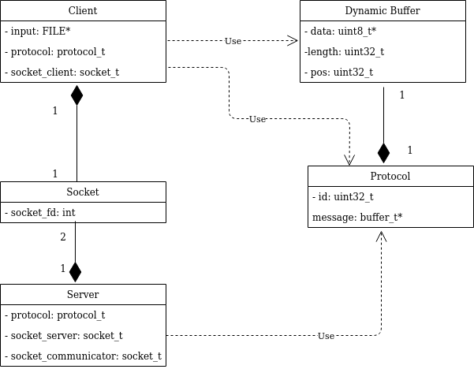
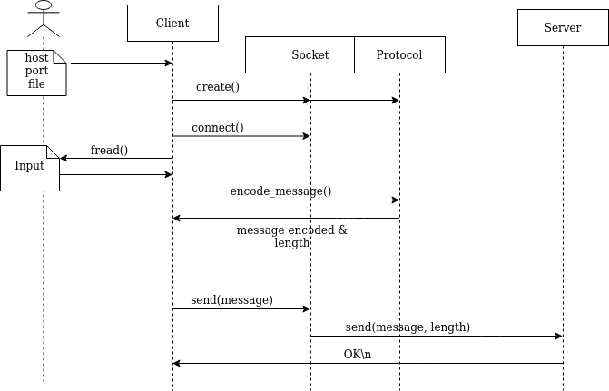
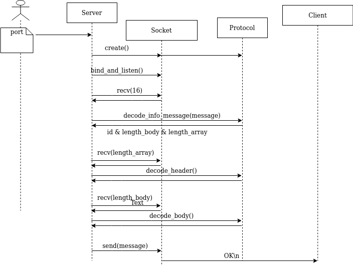
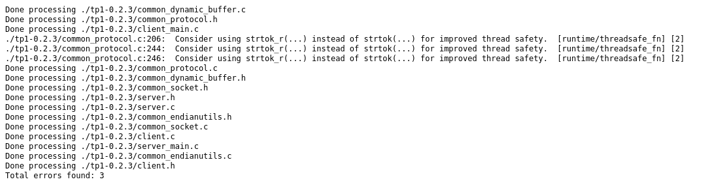
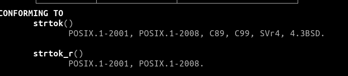

# Informe del Trabajo Práctico 0
### Alumno: Francisco Ruiz. Padrón:99429
### Link: https://github.com/FRuiz811/tp1.git

En el siguiente informe se presentará un resumén de como se encaró la 
resolución del problema planteado en el trabajo práctico. Se adjuntarán 
diagramas descriptivos que intentarán ayudar a la explicación del mismo.
Por último, detallaré algunos inconvenientes a los cuales me enfrente y cómo 
resolví la cuestión.

## Descripción de la Resolución
El siguiente diagrama nos presenta un pantallazo general de como está 
conformada la resolución de la comunicación del Cliente/Servidor utilizando el 
protocolo D-Bus:

Si bien no está detallado a nivel de la implementación, si nos permite ver 
como el cliente y el servidor hacen uso del protocolo para codificar y 
decodificar el mensaje que será enviado a través de un socket que previamente 
tuvo que ser conectado de manera exitosa.

Una importante decisión de diseño, es el uso del protocolo como traductor y no 
como el encargado de realizar el envío/recepción del mensaje, esto es 
responsabilidad exclusiva del cliente o del servidor.

A continuación explicaré a grandes rasgos los pasos que sigue el proceso:

El cliente se conectará al host y al puerto indicados. Es el encargado de leer
el archivo de entrada, ya sea a través de la entrada estándar o aquel que fue 
indicado como parámetro. Lo irá leyendo de a 32 bytes y una vez que se 
garantice de que ya leyó una línea, recurrirá al protocolo para realizar la 
traducción correspondiente.

Una vez en el protocolo, se parseará el mensaje tomando como delimitador el 
espacio " ". Dependiendo de que parte del mensaje se trate, se setearán el 
tipo de parámetro y el tipo de dato para codificarlo según rigen las reglas 
del protocolo D-Bus. Una vez finalizado el encoding del mensaje, se lo 
devolverá al cliente junto con la longitud del mismo.

Ya con el mensaje encodeado, el cliente procederá a enviar a través de su 
socket el mismo, para luego quedar aguardando la confirmación del servidor.

El siguiente diagrama ejemplifica la secuncia recién explicada.

Ahora, situemosnos en el lado del servidor. Este será ejecutado y recibirá 
como parámetro el puerto en el cual escuchará las conexiones entrantes. 
El servidor se conectará a través de un socket al puerto solicitado y alli 
aguardará los mensajes del cliente. Una vez que llegue la solicitud para 
conectarse, el socket aceptará la conexión y nos dará un nuevo socket por el 
cual vamos a poder establecer una comunicación con el cliente.

Una vez conectados, el servidor quedará a la espera de recibir 16 bytes, con 
los cuales obtendrá toda la información necesaria acerca de la longuitud del 
cuerpo, el id del mensaje y la longitud del array de parámetros. Recibidos 
estos bytes, serán enviados al protocolo que será el encargado de decodificar 
la información descripta previamente.

Ya con la información del id, de las longitudes del array y del cuerpo del 
mensaje, el servidor procederá a recibir los siguientes bytes que serán tantos 
como la longitud del array lo disponga. 

Con estos bytes, se volverá a llamar al protocolo, pero esta vez para 
decodificar los parámetros que tendrá nuestro mensaje. 

De igual manera, será el tratamiento de los bytes correspondientes al cuerpo 
del mensaje. 

Con todo esto procesado, el servidor habrá recibido el mensaje enviado y 
continuará notificandole al cliente que llegó correctamente.

El siguiente diagrama ejemplifica la secuncia recién explicada.

## Problemas Encontrados

### Codificación del Protocolo
Debido a la diversidad de longitudes de cada uno de los partes del mensaje y 
la variabilidad de como pueden venir los parámetros, estos pueden estar 
separados por ", " o solamente por "," me encontré con el trabajo de seccionar 
correctamente cada parte sin perder la información y luego cada una de estas 
codificarla de la manera correspondiente. 

Esta parte fue la más engorrosa donde no podía vislumbrar la manera correcta 
de codificar cada una de las partes individualmente y luego unirlas. En ese 
momento, fue cuando opté por generar un buffer dinámico, ya utilizado en la 
lectura del archivo de entrada, dentro del protocolo. Esto me permitió ir 
concatenando los bytes de manera contigua pudiendo independizar las 
codificaciones de cada parte, ya sea para el array de parámetros, el padding o 
el cuerpo del mensaje.

### Recibir información en el Server
El problema en esta parte, también radicó en las diferentes longitudes que 
pueden tener los mensajes, en este caso me afectaría la manera en que los iba 
a recibir. Por eso, decidí dividir la recepción y la decodificación del 
mensaje en 3 partes:

+ Información del Mensaje: se reciben 16 bytes que luego serán enviados al 
protocolo para que traduzca esta información en ID, longitud del array, 
longitud del cuerpo.
+ Header: se reciben tantos bytes como la longitud del array lo disponga. Esto 
se envía al protoco para recibir cada uno de las partes del mensaje separada 
de las demás (destino, ruta, interfaz, método).
+ Cuerpo: En caso de que exita, se reciben tantos bytes como la longuitud del 
cuerpo nos indique. Esto se vuelve a enviar al protocolo para tener cada uno 
de los parámetros separados.

## Aclaraciones
Esta sección está integramente dedicada a realizar aclaraciones acerca de la 
entrega.

### Normas de Codificación
Al intentar ejecutar las normas de codificación, me surgió el siguiente error:

Este error no fue corregido debido a que la recomendación que se da con las 
normas es el uso de una función thread safety, lo cual a fines del trabajo 
práctico actual, es totalmente irrelevante ya que no estamos trabajando con 
threads. Por otro lado, la solución que nos suguieren las normas es el uso de 
la función strtok_r que como se puede ver a continuación no pertenece al 
standard C99 que era una de las restricciones que teniamos a la hora de 
resolver el trabajo práctico.

La decisión tomada fue dejar strtok que si forma parte del standard C99, y que 
a fines de la resolución actual, es muy útil y por ahora, no nos interesa el 
trabajo con threads.